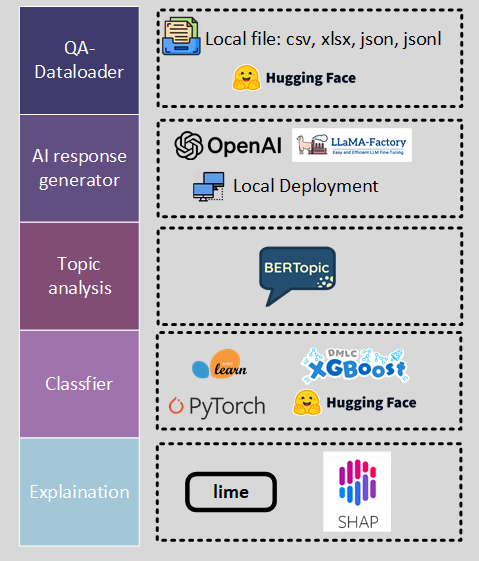

# EveryAI

EveryAI: For any QA text dataset (question and human response), generate AI response, perform topic analysis with bertopic, classify between human responses and AI responses, and explain the model with [Lime](https://github.com/marcotcr/lime) and [Shap](https://github.com/slundberg/shap).
<!-- PROJECT SHIELDS -->

[![Contributors][contributors-shield]][contributors-url]
[![Forks][forks-shield]][forks-url]
[![Stargazers][stars-shield]][stars-url]
[![Issues][issues-shield]][issues-url]
[![MIT License][license-shield]][license-url]
[![LinkedIn][linkedin-shield]][linkedin-url]

<!-- PROJECT LOGO -->
<br />

<p align="center">
  <a href="https://github.com/haowei2000/everyAI/">
    
  </a>

  <h3 align="center">Project Structure</h3>
  <p align="center">
    Optional feature description and simple structure
    <br />
    <a href="https://github.com/haowei2000/everyAI"><strong>Explore the documentation »</strong></a>
    <br />
    <br />
    <a href="https://github.com/haowei2000/everyAI">View Demo</a>
    ·
    <a href="https://github.com/haowei2000/everyAI/issues">Report Bug</a>
    ·
    <a href="https://github.com/haowei2000/everyAI/issues">Request Feature</a>
  </p>

</p>

# Content

- [EveryAI](#everyai)
- [Content](#content)
- [Directory Structure](#directory-structure)
- [Getting Started](#getting-started)
  - [Prerequisites](#prerequisites)
  - [**Installation Steps**](#installation-steps)
  - [Optional Features](#optional-features)
    - [**Feature 1: Use your dataset**](#feature-1-use-your-dataset)
    - [**Feature 2: Choose Generate AI model**](#feature-2-choose-generate-ai-model)
    - [**Feature 3: Choose Classfier model**](#feature-3-choose-classfier-model)
    - [**Feature 4: Use the mongodb database to save and load the dataset**](#feature-4-use-the-mongodb-database-to-save-and-load-the-dataset)
- [Frameworks Used](#frameworks-used)
- [Contributors](#contributors)
- [Version Control](#version-control)
- [Authors](#authors)
- [License](#license)
- [Acknowledgements](#acknowledgements)

# Directory Structure

```
filetree 
├── poetry.lock
├── pyproject.toml
├── LICENSE.txt
├── README.md
├── /images/
├── /src/
│  ├── /everyai/
│  │  ├── /config/
│  │  └── /data/
│  │  └── /model/
│  │  └── /fig/
│  │  └── /result/
│  │  └── /data_loader/
│  │  └── /generator/
│  │  └── /topic/
│  │  └── /classfier/
│  │  └── /explaination/
├── /tests/
└── /util/

```


# Getting Started

To get a local copy up and running follow these simple steps.

## Prerequisites


## **Installation Steps**

1. Install [Poetry](https://python-poetry.org/) from the offical website.
2. Clone the repo

    ```sh
    git clone https://github.com/haowei2000/everyAI.git
    ```

3. Make sure the python version is 3.12.7.

    ```sh
    python --version
    ```

    If the python is mot compatible, you can install python environment with `pyenv` or [conda](https://anaconda.org/anaconda/conda).

4. Install the dependencies with poetry

    ```sh
    poetry install
    ```

5. Run the project

      - Generate AI response with the dataset in [data.yaml](src/everyai/config/data.yaml) and the AI model in [generate.yaml](src/everyai/config/generate.yaml)

        ```sh
        poetry run generate
        ```

      - Perform topic analysis with bertopic([topic.yaml](src/everyai/config/topic.yaml)), please run the command after generating the AI response.

        ```sh
        poetry run topic
        ```

      - Classify between human responses and AI responses with the dataset in [data.yaml](src/everyai/config/data.yaml) and the classfier model in [classify.yaml](src/everyai/config/classify.yaml), and make explaination with `lime` ([lime.yaml](src/everyai/config/lime.yaml)) and `shap` (shap[shap.yaml](src/everyai/config/shap.yaml))

        ```sh
        poetry run classfiy
        ```

      - Run the generate, topic, classfiy together
  
        ```sh
        poetry run every
        ```

## Optional Features

### **Feature 1: Use your dataset**

All the data_configurations are stored in the [data.yaml](src/everyai/config/data.yaml).

There are some ways to use your dataset:

1. Local file

    Supported file types: .csv, .json, .txt, .jsonl
    Open the [data.yaml](src/everyai/config/data.yaml), add a new list item under the `data_list` key, and specify the path to the file or the data_name(If only specify the data_name, please make sure the `{data_name}.{data.type}` file in the [data_folder](src/everyai/data)).

    For example, if you have a csv file named `human_ai_comparsion.csv` in the [data_folder](src/everyai/data), you can add the following configuration to the [data.yaml](src/everyai/config/data.yaml):

    ```yaml
    - data_type: csv
      data_name: human_ai_comparsion
      file_path: 
      question_column: question
      answer_column: answer
      max_count: 200
    ```

2. Huggingface dataset
    Open the [data.yaml](src/everyai/config/data.yaml), add a new list item under the `data_list` key, and specify the `data_type` as `huggingface`, the `data_name` as the dataset name.

    If you have a huggingface dataset in [https://huggingface.co/datasets/wanghw/human-ai-comparison](https://huggingface.co/datasets/wanghw/human-ai-comparison), you can add the following configuration to the [data.yaml](src/everyai/config/data.yaml):
  
    ```yaml
      - data_type: huggingface
        data_name: human_ai_comparsion
        file_path: wanghw/human-ai-comparison
        question_column: "question"
        answer_column: "answer"
        max_count: 200
    ```

3. Optional: you can specify a filter method in [src/everyai/data_loader/filter.py] or just change the default filter method in [src/everyai/data_loader/data_loader.py]

    ```python
    def default_filter(self, data: pd.DataFrame) -> pd.DataFrame:
        return data
    ```

### **Feature 2: Choose Generate AI model**

There are 2 ways to generate AI response:

1. Use the api in `openai format` in [generate.yaml](src/everyai/config/generate.yaml)

   The api is provided by the AI website, you can use the api by setting the `api_key`, `api`, `model_name` in the [generate.yaml](src/everyai/config/generate.yaml) or local or remote deployment with [LLaMA-Factory](https://llamafactory.readthedocs.io/zh-cn/latest/getting_started/inference.html)

2. Use the model in huggingface, you can specify the `model_name` in the [generate.yaml](src/everyai/config/generate.yaml)

      For example, if you want to use the `THUDM/glm-4-9b-chat-hf` model in huggingface, you can add the following configuration to the [generate.yaml](src/everyai/config/generate.yaml):

      ```yaml
      model_name: THUDM/glm-4-9b-chat-hf
      ```

      or download the model to local and setting the model_path

      ```yaml
      model_path: "/root/.cache/modelscope/hub/ZhipuAI/glm-4-9b-chat-hf"
      ```

### **Feature 3: Choose Classfier model**

There are 3 optional classfier model to detect the human response and AI response:

1. Use the sklearn model.

    You can specify the `model_name` in the [classify.yaml](src/everyai/config/classfiy.yaml)

    For example, if you want to use the `SVM` model and `Tf-idf` tokenizer in sklearn, you can add the following configuration to the [classify.yaml](src/everyai/config/classify.yaml):

    ```yaml
    classfier_list:
    - model_name: "SVM"
      tokenizer_name: "TfidfVectorizer"
      split_size:
        train_size: 0.7
        test_size: 0.15
        valid_size: 0.15
      classfier_type: "sklearn"
      model_config:
        gamma: "auto"
      tokenizer_config:
        encoding: "utf-8"
    ```

2. Use the model in huggingface

    TODO: add the huggingface model code

3. Use the model in pytorch

    TODO: add the pytorch model code

### **Feature 4: Use the mongodb database to save and load the dataset**

You can use the mongodb database to save and load the dataset, just set the mongodb connection url and the database name in the [mongodb.yaml](src/everyai/config/mongodb.yaml)

# Frameworks Used

- [Poetry](https://python-poetry.org)
- [Huggingface](https://huggingface.co)

# Contributors

- [Haowei Wang](http://haowei2000.github.io/)
- [Fan Wang](https://github.com/kangyisheng123456)

# Version Control

This project uses Git for version control. You can check the available versions in the repository.

# Authors

[E-mail](hw_wang@whu.edu.cn)
*You can also see the list of contributors who participated in this project.*

# License

This project is licensed under the MIT License. See [LICENSE.txt](https://github.com/haowei2000/everyAI/blob/master/LICENSE.txt) for more information.

# Acknowledgements

- [GitHub Emoji Cheat Sheet](https://www.webpagefx.com/tools/emoji-cheat-sheet)
- [Img Shields](https://shields.io)
- [Choose an Open Source License](https://choosealicense.com)
- [GitHub Pages](https://pages.github.com)
- [Animate.css](https://daneden.github.io/animate.css)
- [isort](https://connoratherton.com/loaders)
- [LLaMA-Factory](https://llamafactory.readthedocs.io/zh-cn/latest/getting_started/inference.html)
- [Huggingface](https://huggingface.co)
- [Poetry](https://python-poetry.org)
- [Best_README_template](https://github.com/shaojintian/Best_README_template)

<!-- links -->
[contributors-shield]: https://img.shields.io/github/contributors/haowei2000/everyAI.svg?style=flat-square
[contributors-url]: https://github.com/haowei2000/everyAI/graphs/contributors
[forks-shield]: https://img.shields.io/github/forks/haowei2000/everyAI.svg?style=flat-square
[forks-url]: https://github.com/haowei2000/everyAI/network/members
[stars-shield]: https://img.shields.io/github/stars/haowei2000/everyAI.svg?style=flat-square
[stars-url]: https://github.com/haowei2000/everyAI/stargazers
[issues-shield]: https://img.shields.io/github/issues/haowei2000/everyAI.svg?style=flat-square
[issues-url]: https://img.shields.io/github/issues/haowei2000/everyAI.svg
[license-shield]: https://img.shields.io/github/license/haowei2000/everyAI.svg?style=flat-square
[license-url]: https://github.com/haowei2000/everyAI/blob/master/LICENSE.txt
[linkedin-shield]: https://img.shields.io/badge/-LinkedIn-black.svg?style=flat-square&logo=linkedin&colorB=555
[linkedin-url]: https://linkedin.com/in/shaojintian

